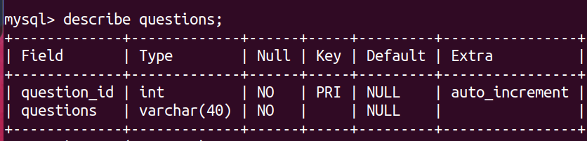
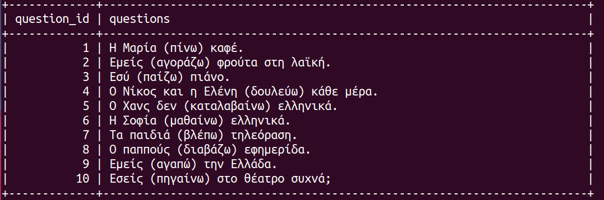
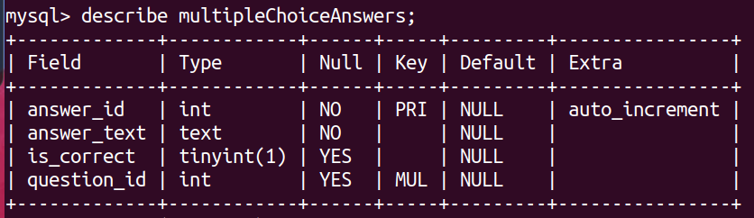
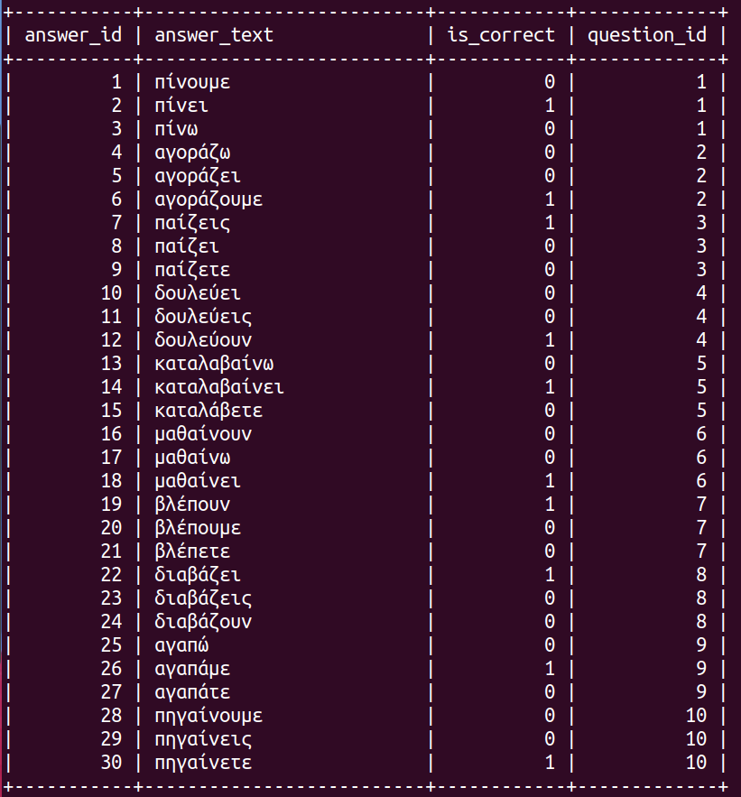

# MVP

# INTRODUCTION

This project is a simple quiz to practise Greek, with a lot of scope for expansion. The app consists of two tables in the database. The user can choose to begin the multiple quiz immediately, or to take a look at the review page first. When completed, the user is presented with their score.

# SETUP

### Dependencies

Run `npm install` in the project folder to install dependencies related to Express (the server).

`cd client` and run `npm install` install dependencies related to React (the client).

## Database Prep

Create `.env` file in project directory and add

```
DB_NAME=todos
DB_PASS=YOUR_PASSWORD
```

(replace `YOUR_PASSWORD` with your actual password)

Alternatively, you can rename the provided `.env.example` file to `.env`.

Type `mysql -u root -p` to access the MySQL CLI using your password.

In the MySQL CLI, type `create database todos;` to create a database in MySQL.

Run the following in the MySQL CLI: `ALTER USER 'root'@'localhost' IDENTIFIED WITH mysql_native_password BY 'YOUR_PASSWORD';` (replace `YOUR_PASSWORD` with your actual password)

Run `npm run migrate` in your **TERMINAL**, in the **project** folder (not your MySQL CLI! Open a new terminal window for this). This will create a table called 'items' in your database.

### Run Your Development Servers

- Run `npm start` in project directory to start the Express server on port 4000
- `cd client` and run `npm run dev` to start client server in development mode with hot reloading in port 5173.
- Client is configured so all API calls will be proxied to port 4000 for a smoother development experience. Yay!
- You can test your client app in `http://localhost:5173`
- You can test your API in `http://localhost:4000/api`

# BACKEND

### Database

The DB is called MVP. It consists of two tables: the questions table and the multipleChoiceAnswer table.


This is the structure of the questions table.


This is the content of the questions table, populated via the init_db.sql document (found in model folder).


This is the multiplchoice answers table structure. The question id is the foreign key here connecting the two tables.


This is the content of the multiple choice answers table, populated again via the init_db.sql document (found in model folder).

### Endpoints

-When a request is made to this endpoint (SELECT....JOIN....), it retrieves data from the DB and joins information from the "questions" table with that of the "multipleChoiceAnswers" table. We have repeated information with this, however, as we receive 3 objects for each question. Each object consists of a question with ONE of it's corresponding potential answers.

-To create just one question object with the 3 possible answers in it, the retrieved data is processed and grouped by question_id.

- A result object is created with the questions and their three corresponding multiple-choice answers all together. This is achieved by using the forEach method and pushing the questions and their answers into the results object if they haven't been "seen" before when the loop is happening.

-The object is turned into an array with the "object.values" method and then shuffled so that it returns a shuffled list of questions each game.

# FRONTEND

-The app consists of the app, homepage, reviewpage and quiz .jsx
-The homepage consists of two buttons where you can start the quiz or do a reivew session first.
-The review page is static and conveys information on the present simple congugation.
-The quiz page consists of a question with 3 potential answers. Once you choose one, you cannot choose again. If correct, it will turn green and you gain a point. If incorrect, it turns red.
-Each game consists of 10 questions (the order is shuffled each time you refresh the page).
-You can review old questions with the previous button and skip forward with the next button (these buttons are disabled at the very start and end).
-At the end you receive your score with a message!

NOTE - The classes of the buttons always read in this order: page they are found on, the page it brings you to/type of button. For example: "quizAnswerButtons" means the Answer Button on the quiz page.
exampe: "homepageReviewButton" means the Review button on the homepage.

-All CSS is found on index.css

# FUTURE PLANS

-User login
-More topics / questions
-Teacher participation - adding / tailoring
-Class creation
-Gamification
-Improve CSS

## Notes

_This is a student project that was created at [CodeOp](http://CodeOp.tech), a full stack development bootcamp in Barcelona._
